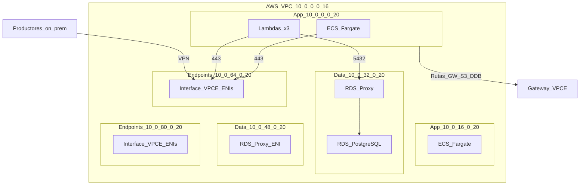

# Arquitectura — Motor de scoring de fraude asíncrono

Este documento describe la **arquitectura objetivo** provisionada por este repositorio, los **trade-offs** y los **no-objetivos explícitos** de la iteración actual. La composición Terraform es la única fuente de verdad; este documento solo resume la intención.

## 1. Contexto

El sistema puntúa transacciones financieras entrantes en busca de fraude de forma asíncrona. Los productores (fuera del alcance de este repo) depositan transacciones en una cola; un pool de contenedores escalado horizontalmente las lee, enriquece cada una con el comportamiento reciente del usuario desde un almacén clave-valor, ejecuta un modelo de scoring y persiste el resultado.

Restricciones duras que guían el diseño:

- **Lab AWS Academy**: cuenta efímera, sin permiso para crear usuarios/roles IAM nuevos. Las cargas de trabajo deben reutilizar `LabRole`.
- Reproducibilidad: todo cambio en la nube debe vivir en código; nada por consola.
- Costo: la cuenta del lab es acotada. Evitamos NAT gateways, claves KMS administradas por el cliente y despliegues multi-región.

## 2. Componentes

| Componente                             | Módulo             | Tipo      | Notas                                                                                                          |
| -------------------------------------- | ------------------ | --------- | -------------------------------------------------------------------------------------------------------------- |
| VPC, tres niveles de subnets privadas, VGW, SG por defecto | `modules/network`  | externo + custom | Envuelve `terraform-aws-modules/vpc/aws ~> 5.13`. **App** (`10.0.0.0/20`, `10.0.16.0/20`), **Data** (`10.0.32.0/20`, `10.0.48.0/20`), **Endpoints** (`10.0.64.0/20`, `10.0.80.0/20`). Sin NAT ni IGW. `propagate_private_route_tables_vgw = true` en las route tables de app. |
| Gateway VPC Endpoints (S3, DynamoDB)   | `modules/network`  | custom    | Asociados solo a las route tables de **app**.                                                                  |
| Interface VPC Endpoints (SQS, ECR-API, ECR-DKR, Logs, SNS, Secrets Manager) | `modules/network` | custom | ENIs en subnets de **endpoints**. SG compartido (`<project>-endpoints-sg`) acepta HTTPS desde CIDRs de app + CIDR on-prem vía VPN. |
| Interface VPC Endpoint Cognito IDP     | `modules/network`  | custom    | Endpoint separado en subnets de endpoints cuya AZ soporta el servicio (`private_dns_enabled = true`).          |
| Cola SQS principal + DLQ + redrive     | `modules/queue`      | custom    | `maxReceiveCount = 5`. SSE-SQS. Política de cola: publicar/consumir con `LabRole` + `DenyInsecureTransport`. La ingesta queda restringida a on-prem **arquitecturalmente** (VPN + Interface VPCE + SG de endpoints); se eliminaron condiciones `aws:VpcSourceIp` / `aws:SourceVpc` porque no se propagan en tráfico VPN cross-VPC hacia un Interface VPCE. |
| Tabla DynamoDB `user_behavior`         | `modules/data_store` | custom    | PK `user_id` (string), `PAY_PER_REQUEST`, SSE activo, PITR activo. Entrada del scoring.                      |
| Bucket S3 de auditoría                 | `modules/data_store` | custom    | Bucket privado para JSON de auditoría opcional por transacción desde el processor Fargate (`S3_AUDIT_BUCKET`). SSE-S3, versionado, lifecycle de 90 días. |
| RDS PostgreSQL `fraud_results`         | `modules/data_store` | custom    | PostgreSQL 17.10, `db.t3.micro`, subnets de **data**, cifrado. Salida del scoring. Configuración single-AZ de lab. |
| RDS Proxy                              | `modules/data_store` | custom    | Pool de conexiones entre Lambdas y RDS en subnets de **data**. `require_tls = true`, `iam_auth = DISABLED`, credenciales vía Secrets Manager. Evita agotar conexiones en `db.t3.micro`. |
| Tópico SNS de resumen + cola SQS de alertas + summarizer | `modules/notification` | custom | Alertas solo por resumen: eventos de fraude se acumulan en SQS, EventBridge dispara una Lambda cada `fraud_alert_summary_interval_minutes` (default 7) y SNS envía un email de resumen a suscriptores confirmados. |
| Cola SQS de resultados + DLQ           | `modules/results_writer` | custom | Buffer directo entre el processor y la Lambda writer. `maxReceiveCount = 3`, visibility timeout 360 s (≥ 6× timeout de Lambda). |
| Lambda results-writer                  | `modules/results_writer` | custom | Go (`provided.al2023`, handler `bootstrap`), en VPC, disparada por SQS. Conecta a RDS vía RDS Proxy.          |
| HTTP API Gateway + Lambda              | `modules/api`        | custom    | Autorizador JWT (Cognito). Rutas: `GET /health`, `GET /stats`, `GET /stats/timeseries`, `GET /filters`, `GET /transactions`, `GET /transactions/{id}`, `GET /users`, `GET /users/{id}`, `GET /users/{id}/behavior` y `/dashboard/*` (perfil, contraseña, invitaciones). Lambda en VPC llega a RDS vía RDS Proxy con capa psycopg2, consulta DynamoDB para el perfil de comportamiento actual y expone una accion interna de migracion solo por invocacion directa de Lambda, no por API Gateway. |
| Cognito User Pool + Hosted UI          | `modules/auth`       | custom    | Inicio de sesión por email, app client PKCE, dominio `itba-fraud-auth-<account-id>`. Google OAuth opcional si están configurados los secrets `GOOGLE_OAUTH_*`. Acceso fino al dashboard en RDS (tabla `dashboard_access`, creada por la migracion de esquema y actualizada por la Lambda API). |
| Sitio web del dashboard en S3          | `modules/dashboard`  | custom    | Bucket de sitio estático público; Terraform sube `index.html`, `app.js` y `config.js` templado (API + Cognito). El workflow **Deploy** sincroniza el export estático con `aws s3 sync`. |
| Repositorio ECR                        | `modules/compute`  | custom    | Tags `IMMUTABLE`, scan-on-push.                                                                                |
| Cluster ECS (Container Insights activo)| `modules/compute`  | custom    | Un solo cluster.                                                                                               |
| Task definition Fargate                | `modules/compute`  | custom    | Imagen del processor en Go. `LabRole` como task role y execution role (restricción del lab).                   |
| Servicio ECS (2 tasks, subnets app)    | `modules/compute`  | custom    | `assign_public_ip = false`, desplegado en subnets de **app**, `lifecycle { ignore_changes = [desired_count] }` para que el autoscaling controle la capacidad. |
| Application Auto Scaling por profundidad de cola | `modules/compute` | custom | Target tracking con metric math (`messages / max(running, 1)`), step scaling de respaldo sobre la métrica `Visible`. Escala entre `min_capacity` (default 1) y `max_capacity` (default 10). |
| VPC on-prem simulada + CGW + VPN Site-to-Site | `modules/onprem_sim` | custom + CFN embebido | VPC `192.168.0.0/16` solo pública con un router EC2 strongSwan (desplegado vía `aws_cloudformation_stack` con `templates/vpn-gateway-strongswan.yml`). `aws_vpn_connection` con BGP contra el VGW. Controlado por `var.enable_onprem_sim` (default `true`). |
| Productores de tráfico on-prem (2× EC2) | `modules/onprem_sim` | custom | Dos recursos `aws_instance` (`producer-1`, `producer-2`) ejecutan un servicio `systemd` que envía transacciones sintéticas de forma continua a la cola SQS de ingesta por VPN (~25 tx/min cada uno por defecto: batch 5 cada 12 s → ~50 tx/min total). Controlado por `var.enable_onprem_traffic_producers` (default `true`). |
| DNS privado de SQS desde on-prem       | `modules/onprem_sim` | custom    | PHZ Route 53 `sqs.<region>.amazonaws.com` asociada solo a la VPC on-prem (registro A apex apunta a IPs privadas del VPCE SQS en subnets de **endpoints**); ruta estática `<aws-vpc-cidr> → ENI strongSwan` en la route table on-prem. |

## 2.1 Niveles de subnets (VPC AWS `10.0.0.0/16`)

| Nivel | Route tables | Gateway VPCE | Propagación VGW | Cargas de trabajo |
| ----- | ------------ | ------------ | --------------- | ----------------- |
| App | RT app por AZ | S3, DynamoDB | Sí (`propagate_private_route_tables_vgw`) | ECS Fargate, Lambdas (API, results-writer, summarizer) |
| Data | RT data por AZ (aisladas) | Ninguno | No | RDS, RDS Proxy |
| Endpoints | RT endpoints por AZ | Ninguno | No (default) | ENIs de Interface VPCE |

El acceso a PostgreSQL desde el nivel app al nivel data se impone con **security groups** (Lambdas/ECS → RDS Proxy → RDS en tcp/5432), no solo por aislamiento de subnets.

## 3. Flujo de datos y control

**Ingesta y scoring:**

1. Dos productores EC2 on-prem dedicados (`producer-1`, `producer-2`) llaman `SendMessage` / `SendMessageBatch` en la cola SQS principal usando el Interface VPC Endpoint de SQS por la VPN. Cada uno ejecuta una unidad `systemd` en bucle indefinido (defaults: 5 mensajes cada 12 s → ~25 tx/min por productor). El router strongSwan solo termina IPsec. Para carga adicional en ráfaga, el workflow de GitHub Actions **Send test transactions** ejecuta `scripts/send_test_transactions.py` en un productor on-prem vía SSM.
2. Las tasks Fargate (processor Go) consumen de la cola, consultan features de comportamiento del usuario en DynamoDB vía Gateway Endpoint de DynamoDB, ejecutan el runtime ML de scoring (con fallback a reglas), opcionalmente escriben JSON de auditoría en S3, actualizan el perfil del usuario en DynamoDB y envían cada resultado a la cola SQS de resultados.
3. Los fallos en la cola de ingesta se reintentan con el visibility timeout de SQS. Tras `maxReceiveCount = 5` entregas, el mensaje pasa a la DLQ de ingesta.
4. CloudWatch Logs recibe logs JSON de contenedores por el Interface Endpoint de Logs. Cada transacción usa un `trace_id` operacional propagado por payload; los logs no incluyen identificadores ni campos de negocio de la transacción.
5. ECR almacena la imagen de contenedor, descargada por los Endpoints ECR API + DKR.
6. Application Auto Scaling lee la profundidad de la cola y la cantidad de tasks en ejecución y ajusta `desired_count` para mantener el backlog objetivo por task.

**Post-análisis, dashboard y resúmenes de notificación:**

7. El workflow **Deploy** invoca directamente la Lambda API con `action = "migrate_database_schema"` para aplicar el esquema PostgreSQL idempotente antes de bootstrap de usuarios o trafico de dashboard. Esa accion no esta mapeada en API Gateway.
8. La Lambda results-writer se dispara con el event source mapping de SQS y escribe cada resultado de fraude en RDS PostgreSQL vía RDS Proxy (`modules/data_store`).
9. Si una transacción puntuada es fraudulenta, el processor también la envía a la cola SQS de alertas de fraude (`modules/notification`).
10. La Lambda summarizer programada drena alertas de fraude pendientes, publica un resumen compacto en SNS y borra mensajes solo después de que `sns:Publish` tenga éxito.
11. La Lambda del dashboard (`modules/api`) es invocada por API Gateway con un JWT de Cognito y consulta RDS vía RDS Proxy para servir resultados de fraude, perfiles de usuario y control de acceso al dashboard.
12. El dashboard estático (`modules/dashboard`) se carga desde S3, autentica usuarios con Cognito Hosted UI y llama a la API con el access token. La creación del admin bootstrap corre en el workflow **Deploy** cuando está configurado `BOOTSTRAP_EMAIL`.
13. Las invitaciones del dashboard gestionan suscripciones email de SNS: la primera activación exitosa solicita una suscripción pendiente de confirmación, y la eliminación por admin intenta desuscribir después de deshabilitar el acceso.

Para seguir una transacción sin exponer datos de negocio en logs, buscar el `trace_id` mostrado en el dashboard en los grupos CloudWatch del processor ECS, results-writer Lambda y, cuando aplique, summarizer Lambda. Los logs de la API usan el `X-Trace-Id` del request HTTP; la API expone el `trace_id` operacional en las respuestas y permite filtrar `/transactions?trace_id=<id>`.

**No hay ingress público** hacia las cargas de la VPC AWS. El dashboard y API Gateway son las únicas superficies públicas (sitio S3 + HTTP API regional).

Cuando `var.enable_onprem_sim = true` (default), `modules/onprem_sim` provisiona una VPC separada `192.168.0.0/16` con una instancia EC2 que corre strongSwan + Quagga BGP, más el `aws_customer_gateway` y el `aws_vpn_connection` que levantan dos túneles IPsec con BGP contra el VGW. La EC2 strongSwan se despliega embebiendo `templates/vpn-gateway-strongswan.yml` dentro de un `aws_cloudformation_stack`, con PSKs entregados por AWS Secrets Manager.

Desde on-prem, el hostname SQS `sqs.<region>.amazonaws.com` resuelve de forma privada al Interface VPC Endpoint de SQS de la VPC AWS mediante una Private Hosted Zone de Route 53 asociada solo a la VPC on-prem. Una ruta estática `<aws-vpc-cidr> → ENI strongSwan` en la route table on-prem canaliza ese tráfico al túnel VPN. Combinado con la VPC AWS solo privada (sin IGW), la ubicación del Interface VPCE y las reglas del security group de endpoints, **solo los productores que pueden alcanzar el VPCE SQS por la ruta VPN pueden publicar**; los consumidores Fargate en la VPC AWS siguen pudiendo `ReceiveMessage` y `DeleteMessage` por el mismo VPCE desde subnets app.

## 4. Trade-offs y no-objetivos explícitos

- **Sin NAT Gateway** — ahorra costo y obliga todo el egress por VPC endpoints.
- **Sin claves KMS administradas por el cliente** — AWS Academy no permite crear CMK. Se usan claves propiedad/gestionadas por AWS en todos lados (S3 SSE-S3, DynamoDB SSE-AWS, SQS SSE-SQS, ECR AES256). Los hallazgos de Checkov están documentados y omitidos en los recursos afectados.
- **`LabRole` como task role y execution role** — AWS Academy no permite crear roles nuevos. Skip documentado `CKV_AWS_249` en `aws_ecs_task_definition`.
- **Simulación on-prem solo BGP y single-AZ.** `modules/onprem_sim` es intencionalmente mínimo (una subnet pública, SG permisivo, un router EC2 más dos productores de tráfico). Se puede desactivar con `var.enable_onprem_sim = false` para evitar costos de VPN y el rollout del stack strongSwan. Para desactivar solo los productores: `var.enable_onprem_traffic_producers = false`.
- **Sin lockdown SQS por `aws:VpcSourceIp` en la cola de ingesta.** El tráfico VPN Site-to-Site cross-VPC hacia un Interface VPCE no rellena las condition keys necesarias para una política de cola confiable; la frontera del lab la dan ubicación de red y reglas de SG.
- **Sin VPC Flow Logs** — omitido a propósito en la huella del lab. Reactivar cuando el hallazgo Checkov `CKV2_AWS_11` sea un requisito duro.
- **Propiedad de imágenes de contenedor.** La imagen del processor se construye en el workflow manual **Deploy** de GitHub Actions, se etiqueta con el SHA del commit, se pushea a ECR y se pasa de vuelta a Terraform como `image_uri`; la posee el servicio Fargate en `modules/compute`. El Dockerfile de la API sirve solo para validación local y no se pushea a ECR porque la API del dashboard corre como Lambda. El Dockerfile del dashboard genera un export estático en lugar de imagen ECR; el workflow Deploy sincroniza ese export al bucket S3 del sitio creado por Terraform.
- **Backend S3 con configuración parcial.** `backend.tf` usa configuración parcial; el nombre del bucket (`itba-tp-fraud-tfstate-<account-id>`) se pasa en `terraform init` vía `-backend-config` en `make init`. No se usa bloqueo DynamoDB en el lab.

## 5. Cómo se cumplen los mínimos académicos

| Requisito (desde `docs/CONSIGNA.md`) | Dónde en este repo                                                                                              |
| ------------------------------------ | --------------------------------------------------------------------------------------------------------------- |
| ≥1 módulo externo                    | `terraform-aws-modules/vpc/aws ~> 5.13` en `modules/network`.                                                   |
| ≥1 módulo custom                     | `modules/network`, `modules/queue`, `modules/data_store`, `modules/compute`, `modules/onprem_sim`, `modules/notification`, `modules/results_writer`, `modules/api`, `modules/auth`, `modules/dashboard` (10). |
| ≥4 funciones Terraform               | `merge`, `format`, `cidrsubnet`, `toset`, `replace`, `length`, `can`, `cidrhost`, `jsonencode`, `contains`, `slice`, `templatefile`, `filebase64sha256`, `filemd5`, `nonsensitive`. |
| ≥3 meta-argumentos                   | `for_each` (gateway e interface endpoints, rutas CORS preflight, Google IdP opcional), `lifecycle { ignore_changes }` (`desired_count` del servicio ECS, `pAmiId` del stack CFN, objetos S3 del dashboard), `lifecycle { create_before_destroy }` (capa Lambda psycopg2), `depends_on` (servicio → regla egress SG, stack CFN → versiones de secret + VPN), `count` (`module.onprem_sim`), más bloques `validation` en cada variable. |
